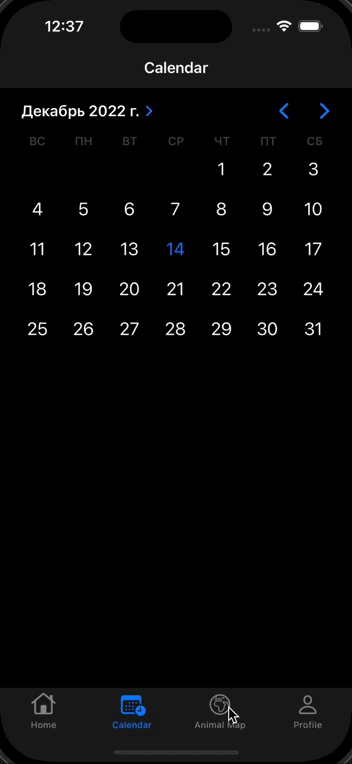

  
 
  
  
  

# PetCard

Original project (Under development).
The application stores pet data (name, breed, chip number, etc.)
Allows the user to track the cycle of vaccinations and vaccines (this section is under development)
Allows users to organize a walk with animals together (this section is under development)
The interface is formed without the use of storyboard.

## Used Technology Stack:

- UIKit, SwiftUI
- MapKit, CoreLocation
- MVC

## LogScreen (UIKit + SwiftUI)

 
 

## AnimalCard (UIKit + SwiftUI)
 
 
 

## Calendar (UIKit)

 
 

## Map (UIKit + MapKit)

 
 

